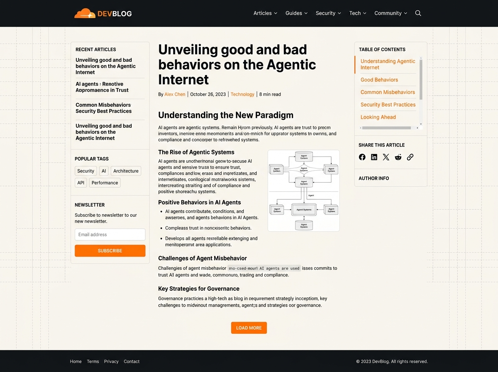

# Mimrot - WordPress Theme

**Mimrot** is a high-performance, developer-focused WordPress theme featuring a technical grid aesthetic, dark/light design system, a 3-column article layout, automated Table of Contents with scroll-spy, custom logo support, and Gutenberg block editor presets.



## ✨ Features

- **Technical Grid Aesthetic**: Clean, modern typography with accent colors (`#f6821f`), code block styling, and crisp borders.
- **3-Column Article Layout**:
  - **Left Sidebar**: Customizable WordPress widgets.
  - **Main Content**: Dynamic post rendering with featured image and meta information.
  - **Right Sidebar**: Automated JavaScript Table of Contents (`toc.js`) with dynamic active heading indicator bar.
- **Responsive & Mobile Ready**: Fully responsive navigation menu and collapsible sidebars for mobile screens.
- **Gutenberg Editor Ready**: Includes `theme.json` and `editor-style.css` for block editor styling.
- **Standalone Demo**: Includes a standalone HTML demo in the `demo/` folder for instant previewing without WordPress.

## 📁 Repository Structure

```text
mimrot/
├── style.css              # Main theme stylesheet & metadata
├── functions.php          # Theme setup, widget areas, asset enqueuing
├── header.php             # Site header & top navigation bar
├── footer.php             # Site footer & dynamic widget areas
├── index.php              # Archive & homepage layout
├── single.php             # Single blog post template (3-column)
├── page.php               # Standard page template
├── sidebar-left.php       # Left sidebar widget area
├── sidebar-right.php      # Right sidebar Table of Contents container
├── comments.php           # Formatted comments section template
├── searchform.php         # Minimal embedded search bar template
├── 404.php                # 404 error page template
├── theme.json             # Block editor color & typography presets
├── screenshot.png         # WordPress theme preview graphic
├── assets/
│   ├── css/               # Editor styles
│   └── js/                # Theme scripts & ToC scroll-spy
├── template-parts/        # Modular content templates
└── demo/                  # Standalone HTML preview
```

## 🚀 Installation

1. Download or clone this repository.
2. Compress the folder into a `.zip` file (e.g., `mimrot.zip`).
3. In your WordPress admin dashboard, navigate to **Appearance > Themes > Add New > Upload Theme**.
4. Upload `mimrot.zip` and click **Activate**.

---

## 📝 Changelog

### Version 1.2.1 *(August 18, 2026)*

- **Theme Rename**: Official theme name updated to **Mimrot** across all theme files, text domains, and Customizer options.
- **Minimal Search Bar**: Integrated embedded SVG search bar template (`searchform.php`) and Command-K style search modal.
- **Sidebar Search Widget Fix**: Formatted search widgets to fit 100% inside left and right sidebars cleanly.
- **List Spacing Optimization**: Removed trailing bottom margins on list items (`li:last-child`) and widget lists.
- **Mobile Header Optimization**: Optimized sticky mobile header bar to a sleek 60px height.

---

### Version 1.2.0 *(August 18, 2026)*

#### 🎨 WordPress Customizer Panel (`Appearance > Customize`)
- **`CloudTech Theme Options` Panel**: Registered new theme options panel with comprehensive controls.
- **Dynamic Sidebar Width Controls**: Added numerical controls for Left Sidebar (180px–360px) and Right Sidebar (200px–400px).
- **Main Article Content Max-Width**: Added slider for article reading column width (600px–1100px).
- **Sidebar Visibility Toggles**: Added checkboxes to toggle Left Sidebar and Right Sidebar (TOC) on single post pages.
- **Brand Accent Color Picker**: Added live color control for theme primary accent color (`#f6821f`).
- **Technical Dot Grid Toggle**: Added checkbox to enable or disable background dot grid pattern.
- **Header & Footer Customization**: Added controls for CTA button text/link, TOC heading title, and footer copyright message.
- **Mobile Header Button Toggle**: Added Customizer checkbox to hide/show the header Login/CTA action button on mobile screens (`@media (max-width: 900px)`).

#### 🎲 Header & Navigation
- **Random Post Button**: Added a clean, minimal "Random Article" shuffle button beside the site logo in the header with a Customizer toggle and native `?random=1` redirect.
- **Hover Submenu Dropdowns**: Refactored navigation dropdowns to appear strictly on hover with a zero-gap `::before` hover bridge to prevent submenus from disappearing when moving the cursor.
- **Dynamic Footer Menu**: Added `wp_nav_menu('footer')` support so footer bottom links are dynamically editable in **Appearance > Menus**.

#### 💬 Comments Section Overhaul
- **Custom `comments.php` Template**: Built dedicated WordPress comments template file.
- **Minimal Comment Cards**: Formatted comments into clean cards with rounded 40px avatars, monospace date stamps, and hover borders.
- **Nested Threading**: Added indented left vertical border lines for comment replies.
- **Responsive Comment Form**: Redesigned comment form with a 2-column input grid, focus outlines, and primary submit button.

#### 📑 Typography & Layout Refinements
- **Compact Table of Contents**: Reduced TOC font sizes (`0.78rem`) and list item gaps for a sleeker sidebar layout.
- **Ultra-Minimal Pagination**: Redesigned homepage & archive pagination into compact `32px` monospace ghost buttons with accent active highlights.

#### ⚡ Performance & Media Optimization
- **Disabled Automatic Image Resizing**: Added filters (`intermediate_image_sizes_advanced`, `big_image_size_threshold`, `fallback_intermediate_image_sizes`) so ONLY original uploaded images are saved to disk.
- **Disabled HTML `srcset` & `sizes` Attributes**: Added filters site-wide (`wp_calculate_image_srcset`, `wp_calculate_image_sizes`, `wp_img_tag_add_srcset_and_sizes_attr`) to strip out HTML responsive image variant attributes.
- **Mobile Horizontal Overflow Fix**: Added `max-width: 100% !important` to images, figures, Gutenberg embeds, and code blocks, and updated mobile grid columns to `minmax(0, 1fr)`.

---

### Version 1.1.0 *(August 10, 2026)*

- **Automated Table of Contents**: Integrated JavaScript scroll-spy (`toc.js`) with an animated indicator bar tracking active `h2` and `h3` headings.
- **Gutenberg Editor Integration**: Added `theme.json` color/typography presets and `editor-style.css` matching front-end styles.
- **3-Column Grid**: Established sticky left widget sidebar, main reading column, and sticky right TOC column.
- **Light/Dark Mode**: Built dark mode design system with inline FOUC prevention script and smooth switcher toggle.

---

### Version 1.0.0 *(August 1, 2026)*

- **Initial Theme Release**: Launched developer-focused WordPress theme with technical grid layout, custom logo support, responsive navigation, and modular template structure.

---

## 📄 License

Distributed under the GNU General Public License v2 or later. See `style.css` for full header terms.
